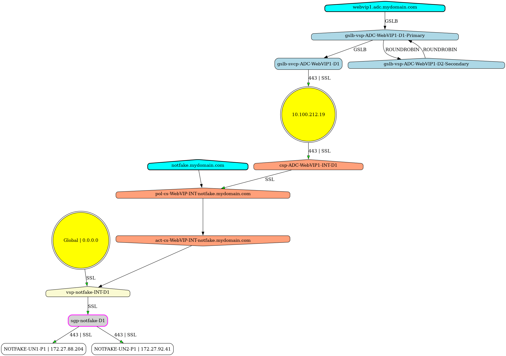

<a id="readme-top"></a>

# nsgraphgen - Netscaler Visualizer

Generates graphs from Netscaler config files to create [graphviz](https://graphviz.org) [dot](https://graphviz.org/doc/info/lang.html) and [mermaid](https://mermaidjs.org) compatible outputs. Useful for documentation.

## Getting Started

### Prerequisites

- `graphviz` for converting from dot output to image formats.

### Install

Coming soon!

## Usage

To use dot formatted output

```shell
nsgraphgen dot -i ns.conf -o ns.dot
dot -Tsvg -ofile ns.svg ns.dot
```

or you can also use the stdout and quiet flags to pipe directly into dot

```shell
nsgraphgen dot -i ns.conf --stdout --quiet | dot -Tsvg -o ns.svg
```

To use mermaid formatted output

```shell
nsgraphgen mermaid -i ns.conf -o ns.out
```

To increase the usefulness of the output of large netscaler config files, it can be helpful to ignore or isolate nodes. This can be done via three different flags, which can be combined. The name values (comma-separated) specified can also include IP addresses.

1. Explicitly naming the nodes you want to ignore (NOTE: this may leave orphaned nodes)

```shell
nsgraphgen dot -i ns.conf -o ns.dot --ignore-name vs-AlwaysUp,DROP,10.1.2.3
```

2. Explicitly naming the types of nodes you want to ignore (NOTE: this may leave orphaned nodes)

```shell
nsgraphgen dot -i ns.conf -o ns.dot --ignore-type Cert,STA,WI
```

Allowed values of --ignore-type: Unknown, AuthAction, AuthPolicy, AuthVServer, Cert, CSAction, CSPolicy, CSVServer, DomainName, GSLBService, GSLBGroup, GSLBVServer, LBGroup, LBVServer, Netscaler, Policy, PolicyLabel, PortalTheme, ResponderAction, ResponderPolicy, RewriteAction, RewritePolicy, Server, Service, ServiceGroup, SessionAction, SessionPolicy, STA, VPNVServer, WI, VIP

3. Isolating to only named nodes, and the edges to/from them.

```shell
nsgraphgen dot -i ns.conf -o ns.dot --isolate-name svg-notfake-D1
```

This can be useful for generating documentation for specific targets.



### Configuration

The precedence order for configuration is

1. command-line flags (highest priority)
2. environmental variables
3. configuration files
4. default values (lowest priority)

You can also store environmental variables for each flag. For example,

```shell
export NSGRAPHGEN_RANKDIR="LR"
export NSGRAPHGEN_IGNORE_NAME="vs-AlwaysUp,DROP,10.1.2.3"
```

By default, nsgraphgen will look in the current directory for a config.yaml file, as well as in `~/.config/nsgraphgen`

An example can be found in [assets/config](https://github.com/littletoyrobots/nsgraphgen/blob/main/assets/configs/)

```yaml
rankdir: "LR"
ignore-name:
  #- "POL-RESPOND-SYS-HTTPtoHTTPS"
  #- "vs-AlwaysUp"
  #- "DROP"
  #- "NOOP"
ignore-type:
  #- "Unknown"
  - "AuthAction"
  - "AuthPolicy"
  - "AuthVServer"
  - "Cert"
  #- "CSAction"
  #- "CSPolicy"
  #- "CSVServer"
  #- "DomainName"
  #- "GSLBService"
  #- "GSLBGroup"
  #- "GSLBVServer"
  #- "LBGroup"
  #- "LBVServer"
  - "Netscaler"
  #- "Policy"
  #- "PolicyLabel"
  - "PortalTheme"
  #- "ResponderAction"
  #- "ResponderPolicy"
  #- "RewriteAction"
  #- "RewritePolicy"
  #- "Server"
  #- "Service"
  #- "ServiceGroup"
  #- "SessionAction"
  #- "SessionPolicy"
  - "STA"
  #- "VPNVServer"
  - "WI"
  #- "VIP"
```

## Roadmap

- [ ] Configure build system
- [ ] Add Changelog
- [ ] Create templates for issues
- [ ] Dark mode for dot export
- [ ] Include Legends toggle
- [ ] Multiple input files?

See the [open issues](https://github.com/littletoyrobots/nsgraphgen/issues) for a full list of proposed features (and known issues)

## Contributing

If you have a suggestion that would make this better, please fork the repo and create a pull request.

## License

MIT-DNBM - [See here](https://github.com/CFPAOrg/MIT-DO-NOT-BOTHER-ME/)

## Contact

## Acknowledgements

- [@emicklei](https://github.com/emicklei) for the dot package this is based off.
-
